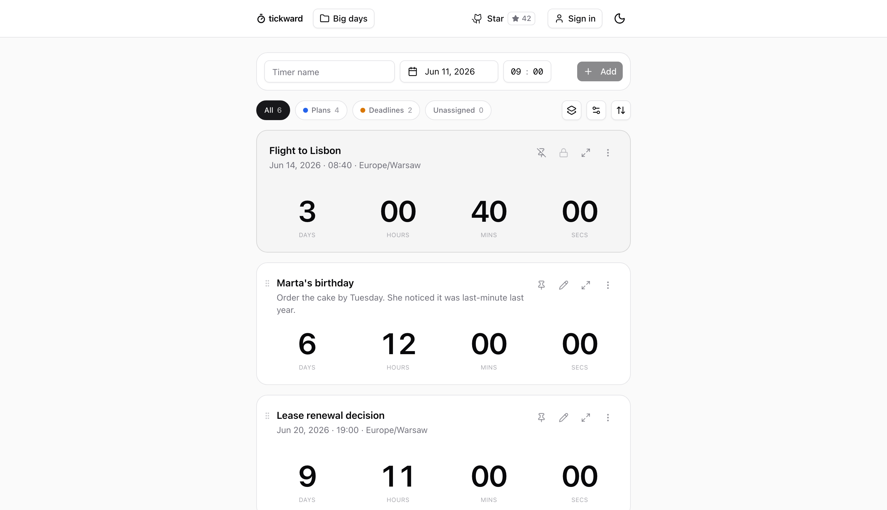

# tickward

[](LICENSE)
[](https://github.com/CorgiCorner/tickward/actions/workflows/container-image.yml)
[](https://github.com/CorgiCorner/tickward/pkgs/container/tickward)

tickward is a self-hostable countdown timer app for timezone-aware timers,
projects, spaces, read-only share links, browser notifications, webhooks, and a
versioned API. It runs as a Next.js app with PostgreSQL for durable project
data and a Redis-compatible REST endpoint for rate limiting.



## Self-Host in 5 Minutes

```bash
git clone https://github.com/CorgiCorner/tickward.git tickward
cd tickward
cp .env.example .env
docker compose --env-file .env pull
docker compose --env-file .env up -d
curl -fsS http://localhost:3000/api/health
```

Open [http://localhost:3000](http://localhost:3000).

The default Compose stack uses `docker.io/corgicorner/tickward:0.9.0` and
starts the app, PostgreSQL, Redis, and a Redis REST proxy. To use the GHCR image
instead, set `TICKWARD_IMAGE=ghcr.io/corgicorner/tickward:0.9.0` in `.env`.
To build from the checkout, run `docker compose --env-file .env up --build`.

## Features

- Timezone-aware countdown and count-up timers with descriptions, images,
  recurrence, archive/restore, and pinning.
- Projects and spaces for grouping personal dates, shared timers, and
  recurring deadlines.
- Read-only public share links under `/share/...`.
- Optional email-code accounts with anonymous project claiming.
- Browser notifications, full-page alarms, and local notification sounds.
- PostgreSQL-backed project data, share records, notification outbox records,
  delivery logs, push subscriptions, and hashed public API keys.
- Webhooks, OpenAPI docs, and MCP support for scripts and agents.

## API Example

```bash
curl "http://localhost:3000/api/v1/capabilities"

curl "http://localhost:3000/api/v1/projects" \
  -H "Authorization: Bearer tw_your_api_key"
```

The public API uses `/api/v1`, bearer API keys from Settings, snake_case JSON
fields, and idempotency keys for mutating requests. See the API quickstart and
reference for create, update, share, and webhook examples.

## Docs Map

- [Self-hosting guide](docs/site/guides/self-hosting.mdx)
- [API quickstart](docs/site/guides/api-quickstart.mdx)
- [API reference](docs/site/api-reference.mdx)
- [Embedding timers](docs/site/guides/embedding-timers.mdx)
- [Webhooks](docs/site/guides/webhooks.mdx)
- [MCP setup](docs/site/guides/mcp.mdx)
- [Recurrence concepts](docs/site/concepts/recurrence.mdx)
- [Countdown accuracy](docs/site/concepts/countdown-accuracy.mdx)
- [Retry-safe mutation recipe](docs/site/guides/recipes/retry-safe-mutation.mdx)

## Local Development

Use Node 22.

```bash
cp .env.example .env
npm ci
npm run dev
```

For development outside Docker, run PostgreSQL, apply migrations, and provide a
Redis-compatible REST endpoint:

```bash
npm run db:migrate:deploy
```

## Star History

If tickward is useful to you, a star helps more people find it.

<a href="https://www.star-history.com/#CorgiCorner/tickward&Date">
  <picture>
    <source media="(prefers-color-scheme: dark)" srcset="https://api.star-history.com/svg?repos=CorgiCorner/tickward&type=Date&theme=dark" />
    <source media="(prefers-color-scheme: light)" srcset="https://api.star-history.com/svg?repos=CorgiCorner/tickward&type=Date" />
    
  </picture>
</a>

## License

tickward is released under the GNU Affero General Public License v3.0. See
[LICENSE](LICENSE).

## Contributing

Public contributions are welcome. See [CONTRIBUTING.md](CONTRIBUTING.md),
[SECURITY.md](SECURITY.md), and [CHANGELOG.md](CHANGELOG.md).

### Translations

tickward ships in English, Polish, and Italian. Grazie to
[@albanobattistella](https://github.com/albanobattistella) for contributing
the Italian translation. To add a language, see the Translations section of
[CONTRIBUTING.md](CONTRIBUTING.md).
